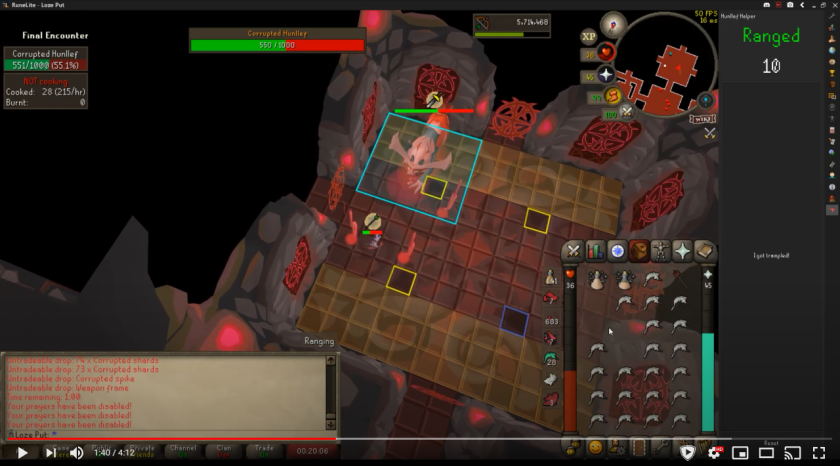

# Hunllef Helper 
The Hunllef Helper is plugin that helps you beating The Gauntlet! The plugin calls out the attack style of the Hunllef.

| NOTE: This plugin does not use any game state information about The Gauntlet. User input is required to make the plugin function correctly. |
| --- |

## Instructions
The plugin automatically opens a RuneLite panel upon entering The (Corrupted) Gauntlet. Do your Gauntlet preparation and enter the bossroom. After the first Hunllef attack hits you, click the 'Start' button of the plugin. The plugin will now call out the attacks which you should pray against. Of course you will never get trampled, but if you do make sure to click the 'I got trampled!' button in the plugin.

### Custom audio
You can configure the plugin to play your own sound files! Follow these steps to configure your custom sounds:
1. Create a folder "audio" in your .runelite folder.
2. Place your audio files in the created audio folder. Note that the audio files must be a .wav format and must not be longer than one second. 
3. Rename your files to exactly match the names: "mage.wav", "range.wav", "one.wav" and "two.wav".
4. Change the audio mode in the plugin configuration to "Custom".
5. Turn the plugin off and on again. This loads your files into the plugin.

## Changes
All changes to the plugin are tracked in the [changelog](https://github.com/Loze-Put/hunllef-helper/blob/master/CHANGELOG.md).

## Feedback
Feel free to open an issue in this repository to provide feedback on the plugin. Feature requests are welcome as well!

## Credits
This plugin is based on the [Gauntlet Helper](https://gauntletcounter.herokuapp.com/) created by [Mazhar](https://twitter.com/Maz_rs). It features the same audio.